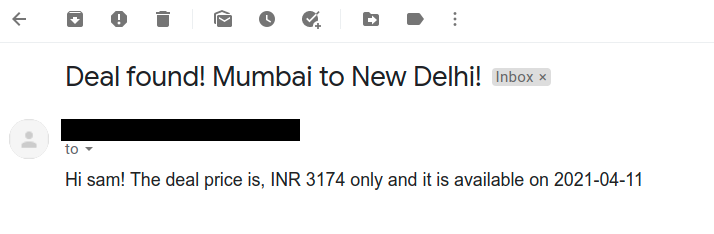
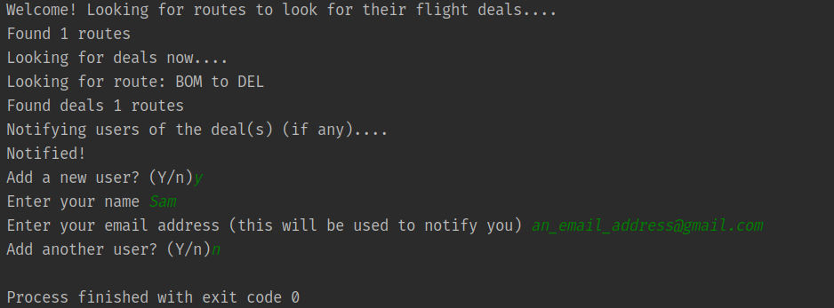

# The Flight Club ✈

## Details:

* Users can sign up to be notified for flight deals!
* The software will look for deals on given routes.
* If any good deals are found in the next 6 months, the best one is selected and the users are notified via email about
  that deal.

## How to use:

* Enter your URLs and API Keys in the [config](the-flight-club/data/config.ini)
* APIs used are:
    1. Sheety (link [here](https://sheety.co/))
    2. Tequila by Kiwi (link [here](https://tequila.kiwi.com/))

## Screenshots:

### The notification email:

### Console output:

